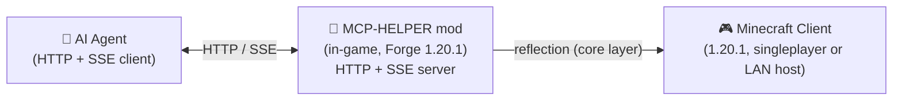

<!-- markdownlint-disable MD033 MD041 MD036 -->
<div align="center">


# MCP-HELPER

**A Minecraft (Forge 1.20.1) mod that exposes the game to AI agents over a built-in HTTP + SSE server.**

[](#license)
[](https://files.minecraftforge.net/)
[](https://www.java.com/)
[](#)

[⬇ Download v1.0](https://github.com/Roxio-sketch/MCP-HELPER/releases/download/v1.0/MCP-HELPER-1.20.1-forge-1.0.jar) · [Source archive](https://github.com/Roxio-sketch/MCP-HELPER/releases/download/v1.0/MCP-HELPER-1.20.1-forge-1.0-sources.zip)

**English** &bull; **[简体中文](readme_zh.md)**

</div>
<!-- markdownlint-enable MD033 MD041 MD036 -->

## What is MCP-HELPER

MCP-HELPER is a **Forge 1.20.1** mod designed for **AI-assisted Minecraft control and mod development**. When the game loads it starts an HTTP server inside Minecraft and exposes a small MCP-style protocol over it. An AI agent can inspect the screen, click through GUIs, send keystrokes, query player/world state, and run bulk world-editing tasks — all without version-specific code on the agent's side.

> Built for mod developers and AI agents: verify GUI behavior, test blocks/items, capture screenshots, and automate repetitive workflows.

- **See** — capture screenshots, with an optional coordinate grid
- **Act** — click, type, scroll, drag, hotkeys, and press any key
- **Know** — query player position, world info, screen buttons, and debug fields
- **Build** — scan, bulk-place, and diff structures; save/place reusable structure NBT
- **Body** — a separate AI-controlled helper player you can teleport, move, and command

---

## Compatibility

| MC version | Loader | Java |
|------------|:------:|:----:|
| 1.20.1 | Forge (loaderVersion `[4,)`, e.g. 47.4.x) | 17 |

This is a single-build mod — one JAR for Forge 1.20.1. There is no Fabric or NeoForge variant in this build.

---

## Installation

1. Download the JAR (for example `MCP-HELPER-1.20.1-forge-1.0.jar`).
2. Put it into your Minecraft `mods` folder.
3. Launch the game with the Forge 1.20.1 profile.

The mod needs a **world loaded** (singleplayer or a hosted LAN world) for the world-editing and helper features; the HTTP server itself starts as soon as the game client is up.

---

## Quick Start

1. **Launch Minecraft** with the mod installed. The mod starts its HTTP server automatically (port 9876 when available; see [Port configuration](#port-configuration)).
2. **Open the status screen** with **F9** (rebindable in *Options → Controls*). It shows the local/HTTP URL, port, LAN addresses, SSE client count, control mode, and MCP-HELPER status.
3. **Connect your AI agent** to the server:
   - Discover the mod: `GET http://127.0.0.1:{port}/api/status`
   - Send commands: `POST http://127.0.0.1:{port}/api/cmd` with a JSON body
   - Stream events: `GET http://127.0.0.1:{port}/api/events` (SSE)
4. **Open the dashboard** at `http://localhost:{port}/debug` for live MCP logs, SSE events, and connection status.

The exact port the mod chose is printed to the console as `[MCP-MOD] Debug page: http://127.0.0.1:{port}/debug`. A clickable in-game chat message with the debug URL also appears.

---

## In-game Status Screen (F9)

Press **F9** to open the **MCP Connection Status** screen. It replaces the old corner overlay and shows all connection state in one place; opening it does **not** freeze the singleplayer world.

Rows shown:

- **HTTP server** — running / not started, the active port, and the listen address (`0.0.0.0`)
- **Local URL** — `http://127.0.0.1:{port}` and the `/debug` path
- **LAN URLs** — the detected LAN IPv4 addresses (e.g. `http://192.168.1.23:{port}`) for other machines on the same network
- **SSE clients** — active SSE client count (out of 4), total HTTP requests, and idle time
- **Control mode** — on/off, mouse mode (`shared`/`detached`), and whether the player can look
- **ESC no-pause** — whether the singleplayer world keeps running on ESC, and whether the world is paused
- **LAN world** — whether the singleplayer world is published to LAN and on which port
- **MCP-HELPER** — whether the helper is present, where it is, or that it spawns with the LAN world
- **Port config** — the effective port, its source, and the config file name

Buttons at the bottom: **Open to LAN** (singleplayer only), **Enter/Exit MCP control**, **Teleport MCP-HELPER**, **Open debug page**.

There is also a **port row** (input box + **Apply & restart** + **Use default**) for changing the port without restarting the game.

---

## Keybindings

| Key | Action |
|-----|--------|
| **F9** | Open / close the MCP Connection Status screen (also teleports MCP-HELPER to you) |
| **F8** | Toggle **MCP control mode** (AI input control) |
| **V** | Toggle the Structure Selector preview mode (Wireframe ↔ Filled Bounds) while holding the selector |

In addition, the vanilla pause screen gets an **MCP Take Over** button that enters control mode from the pause menu.

---

## Port Configuration

The port is **no longer hard-coded to 9876** in this build. Resolution order:

1. `-Dmcp.port=XXXX` — JVM argument
2. `MC_MCP_PORT` — environment variable
3. `config/mcpmod.properties` — generated config file (see below)
4. **default 9876**, falling back through **9875 → 9874 → … → 9000** until a free port is found

The config file is generated on first launch at `<config-dir>/mcpmod.properties` (under Forge's `config/` directory). It ships with the `port` line commented out to preserve the default/fallback behavior; uncomment and set a value to pin it.

Change the port **without restarting the game**:

- **In the F9 status screen**: type a port into the box and press **Apply & restart** (or **Use default**).
- **Via a command**: call `set_port` with the target port; call `get_port` to read the configured port, active port, port source, and the config file path.

The HTTP service restarts on the new port immediately; the SSE connections drop and re-connect.

---

## HTTP API

The mod serves these endpoints (all responses are `application/json`, CORS `*`):

| Endpoint | Method | Description |
|----------|:------:|-------------|
| `/api/status` | GET | Mod identity and live state: `version`, `loader`, `pid`, `port`, `uptime`, `control_mode`, `mouse_mode`, `player_can_look`, `no_pause`, `sse_clients`, `requests`, `last_activity_ms`, `http_url`, `lan_addresses` |
| `/api/cmd` | POST | Execute a command. Body: `{"cmd":"...","params":{...}}` (also accepts `{"method":"...", "param":...}` flat fields). Returns the command result as JSON. |
| `/api/events` | GET | **SSE** stream of call events (last 20 are replayed on connect; heartbeat `: ping` every 15 s; max 4 clients; connection capped at 300 s). |
| `/api/calls` | GET | Last call-history entries (up to 50) as JSON. |
| `/api/screenshot` | GET | Current screenshot as PNG; returns `{"original":"data:image/png;base64,...","grid":"data:image/png;base64,...","width":W,"height":H}` where `grid` adds a 100 px coordinate grid. |
| `/debug` | GET | Serves the packaged live dashboard (`mcp-debug/index.html`). |

### Command format

`POST /api/cmd` accepts either of these bodies:

```json
{ "cmd": "get_world_info" }
```

```json
{ "cmd": "build_structure", "params": { "origin": [100, 64, 200], "blocks": "[[0,0,0,\"minecraft:stone\"], ...]" } }
```

Non-`cmd`/`params` top-level fields are treated as parameters too, and `params` values may be JSON arrays/objects (parsed tightly — see `ToolParams`).

---

## Command Catalogue

Commands are grouped by function. **Note on control mode:** read-only commands, screenshots, bulk world-editing, helper, connection/status, and `screenshot_to_file` work at any time. **Input and GUI-acting commands require control mode** — `click`, `press_key`, `type_text`, `paste_text`, `scroll`, `scroll_at`, `direct_scroll`, `select_list_item`, `mouse_drag`/`drag`, `hotkey`, `set_view_angle`, `look_delta`, `right_click`, `use_item`, `place_block`, `click_button_id`, `click_button_index`, `call_screen_method`, `switch_tab`, and `execute_command`. If MCP control mode is off, the mod returns `not in control mode` for those.

### Connection & status

| Command | Description |
|---------|-------------|
| `ping` | Returns `pong`. |
| `get_connection_info` | Connection/server info. |
| `get_port` | Configured port, active port, port source, config-file path. |
| `set_port` | Change the port and hot-restart the HTTP server. |

### Screenshot & input

| Command | Description |
|---------|-------------|
| `screenshot` | Captures the game as a base64 PNG (`data:image/png;base64,...`). |
| `screenshot_to_file` | Saves a screenshot to `path` on disk. |
| `click` | Clicks at `(x, y)`; `button` = `left`/`right`/`middle`. |
| `press_key` | Presses a key (`key`, optional `hold_seconds`). |
| `type_text` | Types `text`; optional `press_enter`. |
| `paste_text` | Pastes `text`; optional `press_enter`. |
| `scroll` | Scrolls `clicks` steps. |
| `scroll_at` | Scrolls at `(x, y)`. |
| `direct_scroll` | Scrolls with raw mouse coordinates / delta. |
| `select_list_item` | Selects a list item at `index`. |
| `mouse_drag` / `drag` | Drags from `(x1,y1)` to `(x2,y2)` with `button`. |
| `hotkey` | Presses a comma-separated combo (`keys`). |
| `set_view_angle` | Sets the camera to `yaw` / `pitch`. |
| `look_delta` | Adds `delta_yaw` / `delta_pitch` to the camera. |
| `right_click`, `use_item`, `place_block` | Right-click / use item / place block at the crosshair. |

### Info & GUI inspection

| Command | Description |
|---------|-------------|
| `get_player_info` | Player position / health / held item, etc. |
| `get_world_info` | World, dimension, time, and related info. |
| `debug_fields` | Raw debug fields. |
| `get_screen_buttons` | Buttons on the current screen. |
| `enumerate_widgets` | Widgets on the current screen. |
| `click_button_id` | Clicks a screen button by its id. |
| `click_button_index` | Clicks a screen button by its index. |
| `call_screen_method` | Calls a method on the current screen. |
| `switch_tab` | Switches to a screen tab by `index`. |

### Control & game state

| Command | Description |
|---------|-------------|
| `enter_control_mode` / `exit_control_mode` | Enter / leave MCP control mode. |
| `release_mouse` | Releases the mouse cursor (continuous). |
| `set_mouse_sharing` | `enabled` = shared mouse (player can look) vs detached (AI-exclusive). |
| `set_no_pause` | `enabled` = ESC on a singleplayer world does not pause it. |
| `open_to_lan` | Opens the singleplayer world to LAN (`port`, `allow_cheats`). |
| `set_gamemode` | Sets the player's game mode (`mode`, e.g. `creative`). |
| `pause_game` | Opens the pause screen. |
| `open_chat` | Opens the chat screen. |
| `close_screen` | Closes the current screen. |
| `execute_command` | Runs a game command (`command`); `as_helper=true` runs it as the helper. |

### MCP-HELPER body

The mod can spawn an **independent AI-controlled body** in the world so your agent can act in-game without moving your own player.

| Command | Description |
|---------|-------------|
| `spawn_helper` | Spawn the helper player. |
| `helper_info` | Helper's position / state. |
| `helper_goto_player` | Teleport the helper to you. |
| `helper_move` | Move the helper (e.g. to a position / direction). |
| `helper_command` | Run a command as the helper. |
| `helper_remove` | Remove the helper. |

### Efficient world editing

These commands do a whole batch in one call, so an AI agent doesn't need one request per block. `build_structure` works without control mode and paces placement across server ticks.

| Command | Description |
|---------|-------------|
| `scan_area` | Compact scan of a region; returns relative `[dx,dy,dz,id]` tuples, skips air by default (`include_air=false`, `include_block_state=false`). With `include_block_entities=true` it also returns `block_entities` as `[dx,dy,dz,"minecraft:chest",{nbt}]` (block entity NBT as JSON), and is empty (`[]`) when the region has none. |
| `build_structure` | Submits thousands of blocks in one call (`{origin, blocks}`), places them across ticks (`batch` controls pacing only). |
| `compare_structure` | Returns only `missing` / `wrong` / `extra` diffs. |
| `get_build_progress` | Returns only `task_id` / `status` / `total` / `done` / `failed`. |
| `cancel_build` | Cancels the current/active build task. |

`scan_area`/`compare_structure` take `pos1`/`pos2` (or `origin` + `size`); `build_structure` requires `origin` + `blocks`. These need the integrated server, so run them in a singleplayer/LAN-hosted world (a LAN guest cannot edit the world).

### Structures & prefabs

| Command | Description |
|---------|-------------|
| `save_structure` | Saves a region as native Structure NBT under `<game>/mcp_structures/`; optional `prefab=true`, `display_name`, `category`, `anchor`, `export_to` (copies a tree ready for `src/main/resources`), and `use_selection=true` (uses the local player's Structure Selector selection instead of `pos1`/`pos2`). |
| `place_structure` | Places a saved structure at `origin`; `rotation` (0/90/180/270), `mirror`, `anchor`, `include_entities`, `flags`. |
| `list_structures` | Lists saved structures (`id`, `display_name`, `size`, `prefab`). |

Storage layout:

```
<minecraft>/mcp_structures/
├── structures/<namespace>/<name>.nbt   # native Structure NBT
├── prefabs/<namespace>/<name>.json     # prefab metadata
└── index.json                          # runtime index
```

Runtime saves only write into the world / `mcp_structures/`; they never touch the running JAR.

### Structure Selector (in-game manual selection)

The **Structure Selector** (`mcpmod:structure_selector`, obtainable with `/give @s mcpmod:structure_selector`) is a manual front-end for the same structure backend — it does not reimplement any saving logic. It fixes the "two opposite corners do not fit an irregular build" problem: you do **not** have to aim at the whole structure — keep right-clicking the outermost blocks around it and the bounding box grows on its own.

#### 1. Frame the structure

```text
Right-click an outer block   → merge that position into the bounding box (unlimited times)
Right-click again and again  → the box stays the smallest cuboid containing every point
Shift + right-click          → undo the last effective boundary expansion (block or air)
Left-click                   → no point, and no block breaking
```

A point that already sits inside the box reports `Point inside selection, unchanged` and neither moves the bounds nor pollutes the undo history. Every point is added with the right button, so structures are not accidentally mined. Clearing is command-only (`/mcp selection clear`) so it never competes with the Undo gesture.

There is no need to hunt for the two classic WorldEdit corners. For a floating island, just click the outermost spots in any order:

```text
leftmost, rightmost, highest, lowest, front-most, back-most, lowest vine tip, highest canopy
```

The mod collapses them into `minX/maxX`, `minY/maxY`, `minZ/maxZ`.

#### 2. Air positions with no solid block

If a boundary has no actual block, add it from the player instead:

```mcfunction
/mcp selection add                  # the player's current block
/mcp selection add <x> <y> <z>      # explicit coordinates
/mcp selection add ahead <distance> # eye + view direction, e.g. /mcp selection add ahead 20
```

#### 3. Inspect, undo and clear

| Command | Description |
|---------|-------------|
| `/mcp selection info` | Prints dimension, boundary-point count, X/Y/Z ranges, size, volume and validity. |
| `/mcp selection clear` | Clears the selection (the wireframe disappears immediately). |
| `/mcp selection undo` | Undoes the last effective boundary expansion. |
| `/mcp selection add` | Adds the player's current block to the bounds. |
| `/mcp selection add <x y z>` | Adds the given coordinates to the bounds. |
| `/mcp selection add ahead <distance>` | Walks from the eye along the view direction and adds that air position — handy for floating peaks or vine tips that have no solid block. |

#### 4. Preview modes

There are exactly **two** modes. Press **V** while holding the selector to switch, or use the commands:

```mcfunction
/mcp selection preview            # prints the current mode
/mcp selection preview wireframe  # 12 edges only
/mcp selection preview filled     # 12 edges + 6 translucent faces
```

- **Wireframe** (default) — 12 edges plus the six `X-`/`X+`/`Y-`/`Y+`/`Z-`/`Z+` markers. Nothing inside the box, so nothing ever hides the build.
- **Filled Bounds** — the same edges plus 6 translucent faces (alpha ≈ 0.12). This is what makes a `103 × 74 × 86` box easy to judge: is the roof touching the top face, are the lowest vines above the bottom face, is the build fully inside left/right/front/back?

The faces use the normal world depth test, so a face hidden behind the terrain stays hidden — this never turns into an X-ray tool. Filled mode still draws only **6 quads + 12 lines**, so the cost is the same for a `10 × 10 × 10` and a `500 × 500 × 500` selection; the renderer never iterates the blocks in the box.

The mode is a **client setting**: it is persisted in `config/mcpmod.properties` as `selectionPreviewMode=wireframe|filled`, restored on the next launch, and never written into the structure NBT.

#### 5. HUD

While holding the selector, a compact HUD sits on the **left edge, vertically centred** (computed from the current resolution — no hard-coded 1080p coordinates), so it no longer overlaps other mods' top-left HUDs. It shows only persistent state:

```text
Structure Selection
X: 244 → 346
Y: 221 → 294
Z: -3539 → -3454
103 × 74 × 86
655,492 blocks
minecraft:overworld
Last action: Expanded X+ to 346
Preview: Wireframe
```

One-shot results (saved / save failed / entity notes) go to the action bar and chat, not into the HUD. A selection made in another dimension is neither cleared nor silently rebuilt: the wireframe hides and the HUD reports `Selection is in <dimension>`; run `/mcp selection clear` before selecting in the new dimension.

#### 6. Save

| Command | Description |
|---------|-------------|
| `/mcp selection save <name>` | Saves through the existing `save_structure` backend. |
| `/mcp selection save <name> entities` | Also writes the savable entities inside the box into the Structure NBT; placing the structure again spawns them again. A plain `save` does not include entities. |
| `/mcp selection save <name> prefab` | Also registers a runtime prefab (anchor `bottom_center`). |
| `/mcp selection save <name> prefab entities` | Prefab plus entities. |

A name that already exists is refused rather than silently overwritten, and the selection is kept after saving so a prefab can follow.

#### 7. Play it back — no AI required

A saved native structure can be placed with vanilla commands:

```mcfunction
/place template mcpmod:floating_island ~20 ~ ~
/place template mcpmod:floating_island 1000 150 1000
```

This is entirely in-game: **no Codex, no MCP Take Over, no AI tokens**. The mod also ships a thin wrapper:

```mcfunction
/mcp structure place mcpmod:floating_island
/mcp structure place mcpmod:floating_island ahead 120
```

Without `ahead`, the structure is placed at the player's current block; with `ahead <distance>`, at the point `distance` blocks along the view direction.

#### 8. Where the files live

Runtime saves only write into the world / `mcp_structures/`; they never touch the running JAR.

```text
<game-dir>/
└─ mcp_structures/
   ├─ structures/
   │  └─ mcpmod/
   │     └─ floating_island.nbt      ← the native Structure NBT
   ├─ prefabs/
   └─ index.json
```

A copy that vanilla `/place template` resolves is also written to

```text
<saves>/<world>/generated/mcpmod/structures/floating_island.nbt
```

In-game helpers for the folder and the list:

```mcfunction
/mcp structure list                # list the saved structure ids
/mcp structure folder              # open mcp_structures/ in the OS file manager
/mcp structure folder structures   # mcp_structures/structures/
/mcp structure folder prefabs      # mcp_structures/prefabs/
/mcp structure folder generated    # <saves>/<world>/generated/
```

`/mcp structure folder` resolves the path from the running game directory (nothing is hard-coded), creates the directory if missing, and reports `Unable to open structure folder: <path>` instead of failing silently.

#### 9. Import into a real mod

Copy `floating_island.nbt` into the target mod, for example mod id `wuxingxiantu`:

```text
src/main/resources/
└─ data/
   └─ wuxingxiantu/
      └─ structures/
         └─ floating_island.nbt
```

After rebuilding that mod, `/place template wuxingxiantu:floating_island ~20 ~ ~` verifies the real asset.

#### 10. Complete workflow without any AI

```text
1. /give @s mcpmod:structure_selector
2. Hold the selector and right-click every outermost position of the build
3. /mcp selection info
4. /mcp selection preview filled
5. Check that all six faces fully enclose the build
6. /mcp selection save floating_island            (or ... entities)
7. /mcp structure list
8. /mcp structure folder
9. /place template mcpmod:floating_island ~20 ~ ~
10. Copy the NBT into src/main/resources/data/<modid>/structures/
```

> This workflow needs no MCP Take Over, no Codex, and consumes no AI tokens.

Selection state is **server-authoritative and per-player**: each player only ever sees their own selection; the undo history stores only bound snapshots (never a block list), so memory does not grow with volume; the client caches its copy from a single lightweight sync packet sent on boundary change / undo / login / dimension change (never per frame). `save_structure` also accepts `use_selection=true`, which fills `pos1`/`pos2` from the current bounding box so an agent does not have to re-read coordinates.

---

## How It Works

<details>
<summary>📸 Screenshot — click to expand</summary>


</details>



The mod runs an HTTP + SSE server inside Minecraft (port 9876 when available). AI agents talk to it over a simple JSON protocol over HTTP (`/api/cmd`) and stream events over SSE (`/api/events`). The mod is built for Forge 1.20.1; its core GUI/inspection layer leans on Java reflection so the same code can tolerate version differences without per-version forks.

---

## Building from Source

```bash
./gradlew build
```

The produced JAR lands in `build/libs/`. Requirements: JDK 17 and a Java toolchain; the build uses the Forge Gradle plugin and official mappings for 1.20.1.

---

## License

Licensed under the **MIT License** — see [LICENSE-MIT](LICENSE-MIT).

