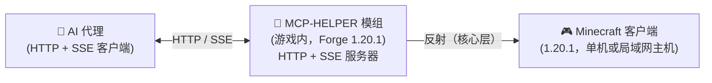

<!-- markdownlint-disable MD033 MD041 MD036 -->
<div align="center">


# MCP-HELPER

**一款面向 AI 代理的 Minecraft（Forge 1.20.1）模组 —— 通过内置的 HTTP + SSE 服务器把游戏暴露给 AI。**

[](#license)
[](https://files.minecraftforge.net/)
[](https://www.java.com/)
[](#)

[⬇ 下载模组 v1.0](https://github.com/Roxio-sketch/MCP-HELPER/releases/download/v1.0/MCP-HELPER-1.20.1-forge-1.0.jar) · [源码归档](https://github.com/Roxio-sketch/MCP-HELPER/releases/download/v1.0/MCP-HELPER-1.20.1-forge-1.0-sources.zip)

**[English](README.md)** &bull; **简体中文**

</div>
<!-- markdownlint-enable MD033 MD041 MD036 -->

## 什么是 MCP-HELPER

### AI 操作 Skill

配套 [minecraft-mcp-helper](skills/minecraft-mcp-helper/SKILL.md) 覆盖独立 AI 局域网入世、实际 debug 地址、玩家操作保护、建筑任务、结构库和结构选择器。将整个目录安装到代理的 skills 目录后，使用 `$minecraft-mcp-helper` 调用。FakePlayer 辅助玩家与独立 LAN 客户端是不同能力。

MCP-HELPER 是一款面向 **AI 辅助的 Minecraft 操控与模组开发** 的 **Forge 1.20.1** 模组。游戏加载后，它会在 Minecraft 内部启动一个 HTTP 服务器，并通过一套简化的 MCP 风格协议把游戏能力暴露出去。AI 代理可以查看画面、点击界面、发送按键、查询玩家与世界状态，还能执行批量世界编辑任务——全程无需在代理侧编写特定版本的代码。

> 专为模组开发者和 AI 代理打造：验证 GUI 行为、测试方块/物品、抓取截图、自动化重复性工作流。

- **看** —— 截取画面，可选带坐标网格
- **动** —— 点击、输入、滚动、拖拽、组合键、按任意键
- **知** —— 查询玩家位置、世界信息、屏幕按钮与调试字段
- **建** —— 扫描、批量放置、对比结构；保存/放置可复用的结构 NBT
- **身** —— 一个独立、由 AI 控制的辅助玩家，可传送、移动、下达命令

---

## 兼容性

| MC 版本 | 加载器 | Java |
|---------|:------:|:----:|
| 1.20.1 | Forge（loaderVersion `[4,)`，如 47.4.x） | 17 |

这是一个单构建模组——一个 JAR 对应 Forge 1.20.1。本构建没有 Fabric 或 NeoForge 版本。

---

## 安装

1. 下载 JAR（例如 `MCP-HELPER-1.20.1-forge-1.0.jar`）。
2. 放入 Minecraft 的 `mods` 文件夹。
3. 用 Forge 1.20.1 配置启动游戏。

世界编辑与辅助玩家功能需要**已加载的世界**（单机或已开启的局域网世界）；HTTP 服务器本身在客户端启动后即开始运行。

---

## 快速开始

1. **启动 Minecraft**（已装模组）。模组会自动启动 HTTP 服务器（可用时优先使用端口 9876，见[端口配置](#端口配置)）。
2. **按 F9 打开状态界面**（可在 *选项 → 控制* 里改绑）。它会显示本机/HTTP 地址、端口、局域网地址、SSE 客户端数量、控制模式与 MCP-HELPER 状态。
3. **把你的 AI 代理连到服务器**：
   - 识别模组：`GET http://127.0.0.1:{port}/api/status`
   - 发送命令：`POST http://127.0.0.1:{port}/api/cmd`，请求体为 JSON
   - 订阅事件：`GET http://127.0.0.1:{port}/api/events`（SSE）
4. **打开仪表盘**：`http://localhost:{port}/debug`，可实时查看 MCP 日志、SSE 事件与连接状态。

模组实际选用的端口会打印到控制台：`[MCP-MOD] Debug page: http://127.0.0.1:{port}/debug`。游戏内聊天栏也会出现一条可点击的调试页面链接。

---

## 游戏内状态界面（F9）

按 **F9** 打开 **MCP 连接状态** 界面。它替代了原先的角落悬浮按钮，把所有连接状态集中在一处展示；打开它**不会**冻结单机世界。

显示的行：

- **HTTP 服务** —— 运行中 / 未启动、当前端口、监听地址（`0.0.0.0`）
- **本机地址** —— `http://127.0.0.1:{port}` 与 `/debug` 路径
- **局域网地址** —— 检测到的局域网 IPv4 地址（如 `http://192.168.1.23:{port}`），供同一网络内其它设备访问
- **SSE 客户端** —— 活跃 SSE 客户端数（上限 4）、累计 HTTP 请求数、空闲时长
- **控制模式** —— 开 / 关、鼠标模式（`shared`/`detached`）、玩家能否转视角
- **ESC 不暂停** —— 单机世界按 ESC 是否继续运行，以及当前世界是否暂停
- **局域网世界** —— 单机世界是否已开启局域网、监听端口
- **MCP-HELPER** —— 辅助玩家是否在场、所在位置，或它会随局域网世界一起生成
- **端口配置** —— 实际生效端口、端口来源、配置文件文件名

底部按钮：**开启局域网**（仅单机）、**进入/退出 MCP 控制**、**传送 MCP-HELPER**、**打开调试页**。

另有一个**端口行**（输入框 + **应用并重启** + **恢复默认**），用于不重启游戏地修改端口。

---

## 快捷键

| 按键 | 作用 |
|------|------|
| **F9** | 打开 / 关闭 MCP 连接状态界面（同时把 MCP-HELPER 传送到你身边） |
| **F8** | 切换 **MCP 控制模式**（AI 输入接管） |
| **V** | 手持结构选择器时切换选区预览模式（纯线框 ↔ 面框） |

此外，原版暂停菜单里会出现 **MCP 接管** 按钮，可直接从暂停菜单进入控制模式。

---

## 端口配置

本构建**不再把端口硬编码为 9876**。解析顺序：

1. `-Dmcp.port=XXXX` —— JVM 参数
2. `MC_MCP_PORT` —— 环境变量
3. `config/mcpmod.properties` —— 自动生成的配置文件（见下）
4. **默认 9876**，被占用时依次回退至 **9875 → 9874 → … → 9000** 直到找到空闲端口

配置文件在首次启动时生成于 `<config目录>/mcpmod.properties`（Forge 的 `config/` 目录）。它默认把 `port` 行注释掉，以保留默认/回退行为；取消注释并填值即可固定端口。

**不重启游戏**即可改端口：

- **F9 状态界面**：在输入框输入端口，点 **应用并重启**（或 **恢复默认**）。
- **命令**：调用 `set_port` 传入目标端口；调用 `get_port` 读取已配置端口、实际生效端口、端口来源与配置文件路径。

HTTP 服务会立即切到新端口；SSE 连接会断开并重连。

---

## HTTP API

模组提供以下端点（响应一律 `application/json`，CORS `*`）：

| 端点 | 方法 | 说明 |
|------|:----:|------|
| `/api/status` | GET | 模组身份与实时状态：`version`、`loader`、`pid`、`port`、`uptime`、`control_mode`、`mouse_mode`、`player_can_look`、`no_pause`、`sse_clients`、`requests`、`last_activity_ms`、`http_url`、`lan_addresses` |
| `/api/cmd` | POST | 执行命令。请求体：`{"cmd":"...","params":{...}}`（也接受 `{"method":"...", 其它扁平字段}`）。返回命令结果 JSON。 |
| `/api/events` | GET | **SSE** 事件流（连接时先回放最近 20 条；每 15 秒发 `: ping` 心跳；最多 4 个客户端；单连接上限 300 秒）。 |
| `/api/calls` | GET | 最近调用历史（最多 50 条）JSON。 |
| `/api/screenshot` | GET | 当前截图为 PNG；返回 `{"original":"data:image/png;base64,...","grid":"data:image/png;base64,...","width":W,"height":H}`，其中 `grid` 叠加了 100 px 的坐标网格。 |
| `/debug` | GET | 提供内置的实时仪表盘（`mcp-debug/index.html`）。 |

### 命令格式

`POST /api/cmd` 接受以下任一请求体：

```json
{ "cmd": "get_world_info" }
```

```json
{ "cmd": "build_structure", "params": { "origin": [100, 64, 200], "blocks": "[[0,0,0,\"minecraft:stone\"], ...]" } }
```

除 `cmd`/`params` 之外的顶层字段也会被视为参数；`params` 里的值可以是 JSON 数组/对象（会严格解析——见 `ToolParams`）。

---

## 命令清单

命令按功能分组。**关于控制模式的说明：** 只读命令、截图、批量世界编辑、辅助玩家、连接/状态以及 `screenshot_to_file` 可随时使用。**输入与 GUI 操作类命令需要控制模式** —— `click`、`press_key`、`type_text`、`paste_text`、`scroll`、`scroll_at`、`direct_scroll`、`select_list_item`、`mouse_drag`/`drag`、`hotkey`、`set_view_angle`、`look_delta`、`right_click`、`use_item`、`place_block`、`click_button_id`、`click_button_index`、`call_screen_method`、`switch_tab` 以及 `execute_command`。若 MCP 控制模式关闭，这些命令会返回 `not in control mode`。

### 连接与状态

| 命令 | 说明 |
|------|------|
| `ping` | 返回 `pong`。 |
| `get_connection_info` | 连接/服务器信息。 |
| `get_port` | 已配置端口、实际生效端口、端口来源、配置文件路径。 |
| `set_port` | 修改端口并热重启 HTTP 服务。 |

### 截图与输入

| 命令 | 说明 |
|------|------|
| `screenshot` | 截取游戏画面，返回 base64 PNG（`data:image/png;base64,...`）。 |
| `screenshot_to_file` | 把截图保存到磁盘 `path`。 |
| `click` | 在 `(x, y)` 点击；`button` = `left`/`right`/`middle`。 |
| `press_key` | 按下按键（`key`，可选 `hold_seconds`）。 |
| `type_text` | 输入 `text`；可选 `press_enter`。 |
| `paste_text` | 粘贴 `text`；可选 `press_enter`。 |
| `scroll` | 滚动 `clicks` 格。 |
| `scroll_at` | 在 `(x, y)` 处滚动。 |
| `direct_scroll` | 用原始鼠标坐标/增量滚动。 |
| `select_list_item` | 选中 `index` 处的列表项。 |
| `mouse_drag` / `drag` | 从 `(x1,y1)` 拖到 `(x2,y2)`，`button` 指定按键。 |
| `hotkey` | 按下逗号分隔的组合键（`keys`）。 |
| `set_view_angle` | 把视角设为 `yaw` / `pitch`。 |
| `look_delta` | 给视角加上 `delta_yaw` / `delta_pitch`。 |
| `right_click`、`use_item`、`place_block` | 在准星处右键 / 使用物品 / 放置方块。 |

### 信息与 GUI 检查

| 命令 | 说明 |
|------|------|
| `get_player_info` | 玩家位置 / 生命 / 手持物品等。 |
| `get_world_info` | 世界、维度、时间及相关信息。 |
| `debug_fields` | 原始调试字段。 |
| `get_screen_buttons` | 当前界面的按钮。 |
| `enumerate_widgets` | 当前界面的组件。 |
| `click_button_id` | 按 id 点击界面按钮。 |
| `click_button_index` | 按索引点击界面按钮。 |
| `call_screen_method` | 调用当前界面的某个方法。 |
| `switch_tab` | 按 `index` 切换界面页签。 |

### 控制与游戏状态

| 命令 | 说明 |
|------|------|
| `enter_control_mode` / `exit_control_mode` | 进入 / 退出 MCP 控制模式。 |
| `release_mouse` | 释放鼠标光标（持续生效）。 |
| `set_mouse_sharing` | `enabled` = 共享鼠标（玩家可转视角）或分离（AI 独占）。 |
| `set_no_pause` | `enabled` = 单机世界按 ESC 不再暂停。 |
| `open_to_lan` | 把单机世界开启到局域网（`port`、`allow_cheats`）。 |
| `set_gamemode` | 设置玩家游戏模式（`mode`，如 `creative`）。 |
| `pause_game` | 打开暂停界面。 |
| `open_chat` | 打开聊天界面。 |
| `close_screen` | 关闭当前界面。 |
| `execute_command` | 执行游戏命令（`command`）；`as_helper=true` 时以辅助玩家身份执行。 |

### MCP-HELPER 身体

模组可以在世界里生成一个**独立、由 AI 控制的身体**，让你的代理无需移动自己的玩家就能在游戏内行动。

| 命令 | 说明 |
|------|------|
| `spawn_helper` | 生成辅助玩家。 |
| `helper_info` | 辅助玩家的位置 / 状态。 |
| `helper_goto_player` | 把辅助玩家传送到你身边。 |
| `helper_move` | 移动辅助玩家（如移动到某个坐标 / 方向）。 |
| `helper_command` | 以辅助玩家身份执行命令。 |
| `helper_remove` | 移除辅助玩家。 |

### 高效世界编辑

这些命令用一次调用完成整批操作，AI 代理无需为一个方块发一次请求。`build_structure` 不需要控制模式，会把放置分散到服务器 tick 上进行。

| 命令 | 说明 |
|------|------|
| `scan_area` | 紧凑扫描一个区域；返回相对 `[dx,dy,dz,id]` 元组，默认跳过空气（`include_air=false`、`include_block_state=false`）。当 `include_block_entities=true` 时额外返回 `block_entities`，格式为 `[dx,dy,dz,"minecraft:chest",{nbt}]`（方块实体 NBT 以 JSON 表示），区域内无方块实体时为 `[]`。 |
| `build_structure` | 一次提交上千个方块（`{origin, blocks}`），跨 tick 放置（`batch` 仅控制节奏）。 |
| `compare_structure` | 只返回 `missing` / `wrong` / `extra` 差异。 |
| `get_build_progress` | 只返回 `task_id` / `status` / `total` / `done` / `failed`。 |
| `cancel_build` | 取消当前/指定建造任务。 |

`scan_area`/`compare_structure` 接受 `pos1`/`pos2`（或 `origin` + `size`）；`build_structure` 需要 `origin` + `blocks`。这些需要集成服务器，因此要在单机/局域网主机的世界里运行（局域网访客客户端无法编辑世界）。

### 结构与预制建筑

| 命令 | 说明 |
|------|------|
| `save_structure` | 把区域保存为原生 Structure NBT，位于 `<游戏>/mcp_structures/`；可选 `prefab=true`、`display_name`、`category`、`anchor`、`export_to`（导出可直接复制进 `src/main/resources` 的目录树），以及 `use_selection=true`（直接使用本地玩家的结构选择器选区，不用再传 `pos1`/`pos2`）。 |
| `place_structure` | 在 `origin` 放置已保存结构；`rotation`（0/90/180/270）、`mirror`、`anchor`、`include_entities`、`flags`。 |
| `list_structures` | 列出已保存结构（`id`、`display_name`、`size`、`prefab`）。 |

存储目录结构：

```
<minecraft>/mcp_structures/
├── structures/<命名空间>/<名称>.nbt   # 原生 Structure NBT
├── prefabs/<命名空间>/<名称>.json     # 预制建筑元数据
└── index.json                         # 运行期索引
```

运行期保存只写入世界与 `mcp_structures/`，绝不会改动正在运行的 JAR。

### 结构选择器（游戏内手动框选）

**结构选择器**（`mcpmod:structure_selector`，用 `/give @s mcpmod:structure_selector` 获得）是同一套结构后端的手动入口，不重写任何保存逻辑。它解决的是"不规则建筑找不准两个对角点"的问题：**不需要对准整个结构**，围着它不断右键最外侧方块，包围盒会自动长大。

#### 1. 框选结构

```text
右键结构外围方块    → 把该坐标并入包围盒（不限次数）
一直右键            → 包围盒始终是包含所有边界点的最小长方体
Shift + 右键        → 撤销上一次有效的边界扩展（对方块或空气都生效）
左键                → 不设点、也不破坏方块
```

点落在当前盒子里时提示 `Point inside selection, unchanged`，不改变边界也不污染撤销历史。加边界点统一走右键，避免误拆结构。清空只走命令 `/mcp selection clear`，避免和 Undo 抢同一个手势。

不需要找传统 WorldEdit 式的两个对角点。框选浮岛时可以任意顺序点击：

```text
最左端、最右端、最高点、最低点、最前端、最后端、最低藤蔓、最高树冠
```

MOD 会自动得到 `minX/maxX`、`minY/maxY`、`minZ/maxZ`。

#### 2. 空气位置选点

某个边界没有实际方块时，用命令补：

```mcfunction
/mcp selection add                  # 玩家当前所在方块
/mcp selection add <x> <y> <z>      # 指定坐标
/mcp selection add ahead <距离>     # 视线前方，例如 /mcp selection add ahead 20
```

#### 3. 查看、撤销与清除

| 命令 | 说明 |
|------|------|
| `/mcp selection info` | 输出维度、边界点数量、X/Y/Z 范围、尺寸、体积与有效性。 |
| `/mcp selection clear` | 清除选区（线框立即消失）。 |
| `/mcp selection undo` | 撤销上一次有效的边界扩展。 |
| `/mcp selection add` | 把玩家当前所在方块加入边界。 |
| `/mcp selection add <x y z>` | 指定坐标加入边界。 |
| `/mcp selection add ahead <距离>` | 从眼睛沿视线前进指定距离，把空中位置加入边界——用于框悬空最高点、藤蔓末端这类没有实体方块的理论边界。 |

#### 4. 两种预览模式

只有**两种**模式。手持选择器时按 **V** 切换，或用命令：

```mcfunction
/mcp selection preview            # 查看当前模式
/mcp selection preview wireframe  # 只画 12 条边
/mcp selection preview filled     # 12 条边 + 6 个半透明面
```

- **纯线框 Wireframe**（默认）—— 12 条边 + `X-`/`X+`/`Y-`/`Y+`/`Z-`/`Z+` 六个极值标记，盒子内部完全透明，最清爽。
- **面框 Filled Bounds** —— 同样的边，再加 6 个半透明面（alpha ≈ 0.12）。这正是 `103 × 74 × 86` 这种大浮岛需要的：屋顶有没有碰到顶面、最低藤蔓有没有高于底面、岛两侧和前后是否全部在面内，一眼就能判断。

面走正常的世界深度测试，被建筑挡住的面仍然被挡住，不会变成 X-Ray 工具。Filled 模式也只多画 **6 个 quad + 12 条线**，`10 × 10 × 10` 和 `500 × 500 × 500` 的渲染开销一样；渲染器绝不遍历选区里的方块。

模式属于**客户端设置**：写进 `config/mcpmod.properties` 的 `selectionPreviewMode=wireframe|filled`，退出再进会沿用，绝不会进入 Structure NBT。

#### 5. HUD

手持选择器时，左侧会显示一个紧凑 HUD，位置是 **屏幕左侧、垂直居中**（按当前分辨率现算，不写死 1080p 坐标），不再和左上角其他 MOD 的境界 / 血量 / 小地图叠在一起。它只显示持久状态：

```text
结构选区
X: 244 → 346
Y: 221 → 294
Z: -3539 → -3454
103 × 74 × 86
655,492 blocks
minecraft:overworld
上次：扩展 X+ 到 346
Preview: Wireframe
```

"已保存 / 保存失败 / 实体保存说明"这类一次性结果走 ActionBar 与聊天栏，不常驻 HUD。选区在别的维度时不清空、也不静默重建：线框隐藏，HUD 提示 `Selection is in <维度>`；要在新维度重新框选，先执行 `/mcp selection clear`。

#### 6. 保存

| 命令 | 说明 |
|------|------|
| `/mcp selection save <名称>` | 调用现有 `save_structure` 后端保存。 |
| `/mcp selection save <名称> entities` | 另外把选区内可保存的实体写进 Structure NBT；重复放置结构会再次生成这些实体。普通 `save` 不保存实体。 |
| `/mcp selection save <名称> prefab` | 另外注册运行时预制建筑（锚点 `bottom_center`）。 |
| `/mcp selection save <名称> prefab entities` | 预制建筑 + 实体。 |

同名结构直接拒绝，不静默覆盖；保存后不清除选区，方便接着存 Prefab。

#### 7. 游戏内复现（不需要 AI）

保存后的原生 Structure 可以直接用原版命令放置：

```mcfunction
/place template mcpmod:floating_island ~20 ~ ~
/place template mcpmod:floating_island 1000 150 1000
```

这完全在游戏里完成：**不需要 Codex，不需要 MCP Take Over，不消耗 AI Token**。MOD 也提供一个更省事的包装：

```mcfunction
/mcp structure place mcpmod:floating_island
/mcp structure place mcpmod:floating_island ahead 120
```

不带 `ahead` 时放在玩家当前所在方块；带 `ahead <距离>` 时放在视线前方指定距离处。

#### 8. 结构文件在哪里

运行期保存只写入世界与 `mcp_structures/`，绝不会改动正在运行的 JAR。

```text
<游戏目录>/
└─ mcp_structures/
   ├─ structures/
   │  └─ mcpmod/
   │     └─ floating_island.nbt      ← 原生 Structure NBT
   ├─ prefabs/
   └─ index.json
```

另外会同步一份原版 `/place template` 能识别的副本到：

```text
<saves>/<世界>/generated/mcpmod/structures/floating_island.nbt
```

游戏内还有两个入口：

```mcfunction
/mcp structure list                # 列出已保存的结构 id
/mcp structure folder              # 用系统文件管理器打开 mcp_structures/
/mcp structure folder structures   # mcp_structures/structures/
/mcp structure folder prefabs      # mcp_structures/prefabs/
/mcp structure folder generated    # <saves>/<世界>/generated/
```

`/mcp structure folder` 的路径从当前运行目录现算（不硬编码），目录不存在会先创建；打不开时提示 `Unable to open structure folder: <路径>`，不会静默失败。

#### 9. 导入正式 MOD

把 `floating_island.nbt` 复制到目标 MOD，例如 mod id 为 `wuxingxiantu`：

```text
src/main/resources/
└─ data/
   └─ wuxingxiantu/
      └─ structures/
         └─ floating_island.nbt
```

重新构建该 MOD 后，`/place template wuxingxiantu:floating_island ~20 ~ ~` 即可验证正式资产。

#### 10. 完全不用 AI 的完整工作流

```text
1. /give @s mcpmod:structure_selector
2. 手持选择器，右键结构所有最外围位置
3. /mcp selection info
4. /mcp selection preview filled
5. 检查六个面是否完整包围建筑
6. /mcp selection save floating_island            （或加 entities）
7. /mcp structure list
8. /mcp structure folder
9. /place template mcpmod:floating_island ~20 ~ ~
10. 把 NBT 复制进 src/main/resources/data/<modid>/structures/
```

> 这套流程不需要 MCP Take Over，不需要 Codex，也不会消耗 AI Token。

选区状态**以服务端为准、按玩家隔离**：每个玩家只看得到自己的选区；撤销历史只保存极值快照（不保存方块列表），内存与选区体积无关；客户端只在边界变化 / undo / 登录 / 切维度时接收一个轻量同步包（不逐帧发包）。`save_structure` 也支持 `use_selection=true`，直接把当前包围盒的 min/max 填成 `pos1`/`pos2`，AI 不需要重新读取坐标。

---

## 配套 Codex Skills

[Minecraft Agent Skills](https://github.com/Roxio-sketch/minecraft-agent-skills) 提供 AXO 实例启动与 Minecraft Photon 特效自动化 skills，可通过兼容构建与 MCP-HELPER 联动。Photon 操作属于构建相关的扩展能力；使用前请确认实际安装版本支持。

## 工作原理

<details>
<summary>📸 截图 —— 点击展开</summary>


</details>



模组在 Minecraft 内部运行一个 HTTP + SSE 服务器（可用时优先端口 9876）。AI 代理通过 HTTP（`/api/cmd`）以简洁 JSON 协议通信，并通过 SSE（`/api/events`）订阅事件流。模组面向 Forge 1.20.1 构建；其核心 GUI/检查（inspection）层借助 Java 反射，使同一套代码能容忍版本差异而无需为每个版本单独分叉。

---

## 从源码构建

```bash
./gradlew build
```

产物 JAR 位于 `build/libs/`。要求：JDK 17 与对应工具链；构建使用 Forge Gradle 插件与 1.20.1 官方 mappings。

---

## 许可证

以 **MIT 许可证** 授权 —— 见 [LICENSE-MIT](LICENSE-MIT)。

